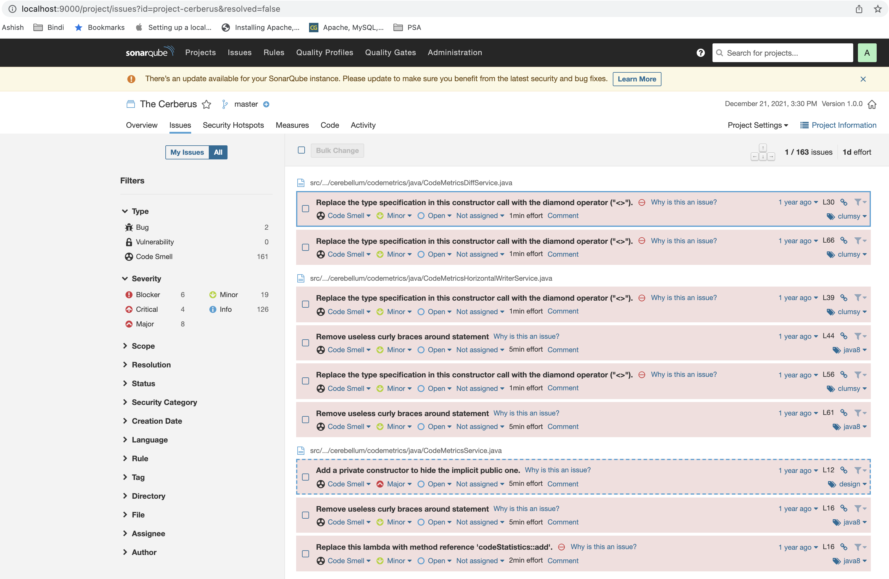

# Peer Programming - Enable Static code analysis

Detail explaination of peer programming excerise with @dsvellal held on 20th December, 2021. Task was given to enable static code analysis on open source project - [Cerberus](https://github.com/philips-software/cerberus)

## What tool was selected? Why?

[SonarQube](https://www.sonarqube.org/) as static code analysis platform was selected to perform static code analysis.

@ashishbhatt12 has good experience on SoanrQube platform and SonarQube is widley used for static code analysis and code coverage reports for most of languages.

## How was SonarQube setup?

SonarQube was setup on top of Docker to simplify and build plarform faster using below command.

 *`docker run -d --name sonarqube -p 9000:9000 -p 9002:9002 sonarqube`*

## How project Cerberus is configured to scan through sonar?

Additional task for sonarqube added in [build.gradle](build.gradle) file as below to configure sonar project properties.

```
sonarqube {
    properties {
        property "sonar.projectKey", "project-cerberus"
        property "sonar.projectName", "The Cerberus"
        property "sonar.sourceEncoding", "UTF-8"
    }
}
```

Additionally plugin for sonarqube added as below. Also to have coverage reports generated, jacoco plugin is also added. Overall plugins look as below.

```
plugins {
    id "jacoco"
    id 'com.github.johnrengelman.shadow' version '6.0.0'
    id 'java'
    id 'application'
    id "org.sonarqube" version "3.3"
}
```
With additional jacoco test report connfiguration.

```
jacocoTestReport {
    reports {
        xml.enabled true
    }
}
```

## How code is scaned and configured in SonarQube?

Script [scan-code.sh](scan-code.sh) created to run gradle command. Below command used in script to execute build, test and perform sonar scan. 

*<code>gradle build jacocoTestReport sonarqube</code>*

However, it is not mandatory to use scan-code.sh script to perform scan. Direct gradle command can be used on command line.

Below is the screengrab from SonarQube dashboard after successful sonar scans.

  


##  What issues faced during peer programming session?
- There were multiple java versions configured on machine. Later java 8 was uninstalled and JAVA_HOME env variable reconfigured to set to Java 11.
- Build was failing due to below gradle dependency configuration.

    `testCompile 'org.mockito:mockito-core:2.+'`

- Later, I changed it as below make it compile and  proceed further.

   `implementation 'org.mockito:mockito-core:2.+'`

## How this  can  be scaled or used!?

- Ideally soanr reports can be intragated and attached with pull requests for reviewer to review.
- Sonar scanner steps to be added into CI pipeline in order to continuous code scanning.
- Sonar qualitty gates can be enabled and integrated with CI/CD pipeline in order to ensure quality code pushed to releases.